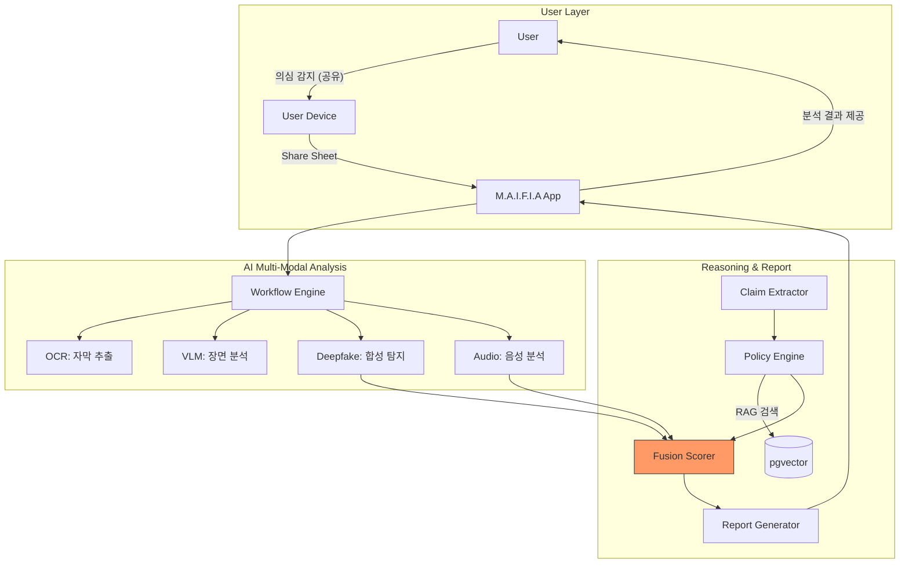

# 코디세이 AI 올인원 1기 입학연수과정 팀 "5-S(오싹)" 기획안

---

## 문제정의

### ❖ 해결하고자 하는 문제

숏폼 이커머스 퍼널이 '광고→상세→결제'가 한 영상 안에 압축되면서 검증 단계 자체가 사라졌고, 그 위에 AI 생성 가짜 전문가 광고까지 폭증했지만 정부 대책(2025-12 종합대책·2026-Q1 후속 법제)은 사후 표시·제재 구조에 머물러 집행 공백이 남는다.

일반 소비자 — 특히 유튜브·인스타그램·틱톡 의존도가 높은 중장년·고령층은 건강기능식품·화장품·다이어트 숏폼 광고의 허위·과장 여부를 스쳐 지나가는 그 순간 실시간으로 판별할 수단이 없어 검증 없이 구매로 직행한다.

### ❖ 주제 선택 이유

- 허위·과장 광고는 영상 장면·자막·주장이 복합 결합된 다중 기만이라 룰·키워드 매칭으로 풀 수 없는 멀티모달 AI 전담 문제
- AI 허구 권위자에 가장 취약한 중장년·고령층(70대 뉴스 유튜브 93.1% · 60대 과의존 고위험군 3년 연속 증가)이 숏폼 이커머스 동선 한복판에 이미 포섭돼 있음
- 지금 개입해야 할 공적 수요가 실재함

---

## 타겟 사용자

### ❖ 서비스의 주요 사용자 정의

| 구분 | AI 광고 취약 소비자 보호자 | 보호자·가족 대리 검증자 |
|------|--------------------------|----------------------|
| **대상** | AI 딥페이크·가짜 의사에 취약한 중장년 & 고령층 여성 | 성인 자녀 (부모 대신) · 부모 (자녀용 아동 제품 대신) 피보호자의 숏폼 광고를 대신 공유·검증 |
| **Pain Point** | • 권위 연출, 감정적 공감에 즉시 설득 • AI 합성 판단 불가 • 검증 피로 (영상이 지나가면 재검색 비용 큼) | • 반복 검증 피로 • 자녀용 제품 광고 확인 부담 • AI 합성 판단 불가 • '막연한 불안감'으로 말리는 상황 |

### ❖ 사용자 니즈 분석
 * 국내 온라인쇼핑 거래액은 272조(2025), 그중 모바일 비중이 75.9%(2025-09 기준) 에 달하며 이커머스의 소비 접점이 모바일로 완전히 이동했다. 이 모바일 공간 내부에서도 소비 시간의 무게 중심은 영상·숏폼으로 쏠린다 — 영상 정보 소비의 92.2%가 유튜브에 집중되고, 숏폼 이용률은 1년 새 11.1 → 22.9%로 2배 이상 급증(뉴스·정보 소비 대표 지표 기준)했다. 그 결과 거대한 이커머스가 이 숏폼 주도 채널을 따라 함께 진입했고, 여기서 유통되는 광고에서 식약처는 2025년 AI 가짜 전문가 부당광고 63건과 SNS 식품 광고 225건 중 65% 위반을 적발했다.
본 서비스는 이 문제 환경을 정면으로 겨냥한다. 1차 타겟(SAM)은 건강·뷰티·다이어트 관심도가 높고 구매 전환이 가장 활발한 40~60대 여성이며, MVP 파일럿(SOM)은 그중 수도권·모바일 익숙·공유 기능 활용 가능한 50~60대 초반 여성 100~500명이다.이들의 핵심 니즈는 다음 4 가지로 수렴한다.
---
**시장 현황:**
- 국내 온라인쇼핑 거래액: 272조(2025)
- 모바일 비중: 75.9%(2025-09 기준)
- 영상 정보 소비 92.2%가 유튜브에 집중
- 숏폼 이용률: 1년 새 11.1 → 22.9%로 2배 이상 급증

**규제 현황:**
- 식약처 2025년 AI 가짜 전문가 부당광고: 63건
- SNS 식품 광고 225건 중 65% 위반 적발

**1차 타겟(SAM):** 건강·뷰티·다이어트 관심도가 높고 구매 전환이 활발한 40~60대 여성

**MVP 파일럿(SOM):** 수도권·모바일 익숙·공유 기능 활용 가능한 50~60대 초반 여성 100~500명

**핵심 니즈 4가지:**
1. 의심 광고를 정식 검증 절차로 즉시 올리기
2. 숏폼이 지나가도 공유 1회로 검증 시도 가능
3. AI가 꿰뚫어본 근거로 구체적인 답을 손에 쥐기
4. 가족 공유를 통해 한 번의 검증이 가족 단위 보호로 확장

---

## 서비스 개요

### ❖ 서비스 이름

**M.A.F.I.A** (Monitoring Ad intelligent Filter & Inspection Agent)

### ❖ 핵심 기능

| 기능 | 설명 | 사용자 가치 |
|------|------|-----------|
| **의심 광고 영상 원탭 전송** | 숏폼 앱의 공유 버튼으로 MAFIA를 호출하면 광고URL·영상·설명란이 자동 전송되어 분석 파이프라인에 투입 (별도 앱 전환·복사·붙여넣기 없음) | 지나치던 의심이 '정식 검증 절차'로 올라간다 — 숏폼이 지나가 버려 재확인할 수 없던 순간에도, 공유 1회로 검증 시도 자체가 가능해진다. 멀티모달 AI 기반 |
| **허위·과장·딥페이크 판별** | ① 시각(장면·권위·시각적 연출·Before/After) ② 텍스트(자막·효능 문구·긴급성 표현) ③ AI합성(딥페이크 얼굴 + 음성) — ①,②,③ 병렬로 교차 검증 | 의심이 확신으로 바뀐다 — AI가 대신 꿰뚫어 본 결과로 "이 광고가 진짜인가?"에 구체 근거가 붙은 답을 손에 쥐게 된다. |
| **근거 리포트 공유 카드 생성** | 위반 유형·관련 규정 조항·위험도를 요약 카드로 정리, 카톡·문자 등으로 사용자가 선택한 대상에게 그대로 전달 (대표 사용 시나리오: 가족·지인 공유) | 한 번의 검증이 가족 단위 보호로 확장된다 — 리포트 공유 한번으로 부모·자녀도 같은 근거로 판단할 수 있어, 혼자 고민하던 구매 결정이 가족 대화로 열린다. |

### ❖ 기존 서비스 대비 차별점

| 항목 | ScamAdviser | Fakespot | Sensity | MAFIA |
|------|------------|----------|---------|-------|
| **타겟 사용자** | 일반 소비자 (웹사이트 의심 시) | 쇼핑 소비자 (영어권) | B2B 기업 | 한국 B2C 소비자 (중장년) |
| **판별 즉시성** | 즉시 (URL 조회) | 즉시 (쇼핑몰 URL) | B2B 실시간, B2C 수동 | 공유 1회 → 60초 |
| **광고 컨텐츠 분석 깊이** | 웹사이트 도메인 | 쇼핑 리뷰 텍스트 | 얼굴·음성 합성 | 영상+자막+음성+AI 합성 통합 |

---

## AI 기술 적용

### ❖ 적용할 AI/ML 기술

| 기만 축 | 대응 기술 | 선택 근거 |
|--------|---------|---------|
| **① 시각 기만** (흰가운·병원배경·Before/After) | VLM (Gemini 2.5) + 영상 딥페이크 판별 (MesoNet→LAA-Net) | 장면 의미 해석 + 얼굴 합성 탐지 동시 필요 |
| **② 자막 기만** (효능 단정·긴급성) | VLM 통합 OCR + PP-OCRv5 보조 | VLM으로 통합 추출, 한국어 소형 자막은 보조 OCR 보강 |
| **③ 음성 기만** (나레이션 주장·합성음성) | ASR (Whisper-large-v3) + 음성 Anti-Spoofing(AASIST) | "무엇을 말하는가" + "누가 말하는가" 분리 대응 |
| **④ 규정 위반 판정** (효능 암시·금지표현) | LLM (Structured Output) + OPA (Rego) + RAG (BGE-M3+pgvector) | 자연어 해석 + 결정론 필터 + 규정 근거검색 3단 결합 |

**통합 분석 전략:**
MAFIA는 광고 영상의 4중 기만을 통합 분석한다:
1. 시각(장면·권위 연출)
2. 자막(효능·긴급성 문구)
3. 음성(나레이션 주장)
4. AI 합성 인물(딥페이크)

각 기만 축에 1:1 매핑된 AI/ML 모델 6개 + 엔지니어링 파이프라인 3개와 기술 요소 조합으로 해결

### ❖ 기술 선택 이유

본 서비스는 광고를 **"보고 듣는다 → 판단한다 → 위조를 확인한다"** 3단계로 검사

| 단계(비유) | 풀어야 할 문제 | 선택한 기술 | 선택 이유 |
|-----------|--------------|-----------|---------|
| **① 보고 듣는다 (해설가)** | 시각·자막·음성 주장을 빠짐없이 추출 (자막 없는 음성 거짓말 놓침 방지) | VLM + ASR + 보조 OCR + 장면 분할 (Gemini · Whisper · PP-OCR · PySceneDetect) | • VLM이 OCR까지 포함 → 별도 OCR 호출 제거 • Whisper로 자막 없는 음성 주장 커버 • PP-OCR은 한국어 소형 자막 전용 보조 |
| **② 판단한다 (변호사)** | 법 위반 여부를 근거 있게 판정 (사용자 보호 위해 놓치는 위반 최소화) | LLM+규정 엔진+법 조항 검색 (Gemini · OPA · BGE-M3 + pgvector) | • LLM은 자연어 해석 담당 (OPA가 못함) • OPA는 결정론 규칙 판정 (LLM 환각 방지) • RAG로 '왜 위반인지 법 조항 근거 제시 |
| **③ 위조를 확인한다 (과학수사대)** | AI가 만든 가짜 얼굴·목소리는 사람 감각으로 구별 불가 | 영상 딥페이크 탐지+음성 딥페이크 탐지 (MesoNet → LAA-Net · AASIST + Wav2Vec2 feature) | • MesoNet 경량 → 학생 팀 GPU MVP 구현 가능 • Phase 2에 LAA-Net (CVPR 2024 SOTA) 업그레이드 • AASIST가 판별, Wav2Vec2는 특징만 추출 |

---

## 시스템 구성

### ❖ 사용자 플로우

| 단계 | 구성요소 | 작업 |
|------|--------|------|
| 1 | User | 숏폼 광고 보다가 허위·과장 의심 |
| 2 | User Device | 공유 버튼 눌러 공유 시트 호출 |
| 3 | M.A.F.I.A App | 광고 URL·정보 자동 수집해 서버 전송 |
| ⟳ | Result View | 분석 완료 후 위험도·근거·딥페이크 결과 표시 |

### ❖ 아키텍처 구성

#### Backend · Request Handling (요청 접수 · 작업 큐 등록)

| 단계 | 구성요소 | 작업 |
|------|--------|------|
| 4 | API Gateway | 요청 라우팅 · 인증 확인 |
| 5 | FastAPI Backend | 요청 접수 · 즉시 응답 |
| 5-1 | PostgreSQL | 요청 정보 기록 |
| 6 | Workflow Engine | 분석 작업 병렬 조율 |

#### Backend · Video Preprocessing (영상 하나를 4종 데이터로 분해)

| 단계 | 구성요소 | 작업 | 입력 | 출력 |
|------|--------|------|------|------|
| 7 | Preprocessor | 영상을 4종 데이터로 분해 | 광고 영상 파일 | frames · keyframes · face crops · audio |

#### Multi-Modal · Parallel Analysis (4개의 AI가 글자·장면·얼굴·음성을 동시 분석)

| 단계 | AI 트랙 | 기술 | 입력 | 분석 결과 |
|------|--------|------|------|----------|
| 8-A | OCR | PP-OCRv5 | frames | 자막 · 배너 텍스트 |
| 8-B | VLM | Gemini 2.5 | keyframes | 장면 · 연출 설명 |
| 8-C | Deepfake | MesoNet | face crops | 얼굴 합성 확률 |
| 8-D | Audio | Wav2Vec2 | audio | 음성 합성 확률 |

#### Reasoning · Report (주장 정리→규정 대조→통합 점수→리포트)

| 단계 | 구성요소 | 작업 | 단계 | 구성요소 | 작업 |
|------|--------|------|------|--------|------|
| 9 | Claim Extractor | 원본 텍스트 → 구조화 JSON 변환 | 12 | Report Generator | 사용자용 리포트 변환 |
| 10-1 | pgvector | 식약처·공정위 규정 DB 검색 | 12-1 | S3 / MinIO | 원본 데이터 저장 후 파기 |
| 10-2 | Policy Engine (OPA) | 위반 조항·심각도 판정 | 13 | Result View | 위험도·근거·딥페이크 결과 표시 |
| 11 | Fusion Scorer | 신호 가중치 통합 → 위험도·근거 산출 |

---

## 기대 효과

### ❖ 사용자 기대효과

- **[Safe]** 딥페이크·사칭 광고의 실시간 차단으로 정보의 격차로 인한 피해를 방지
- **[Smart]** 단 한 번의 공유만으로 복잡한 확인 절차 없이 허위·과장 여부를 즉시 판별하는 직관적이고 정밀한 검증
- **[Together]** 미성년자부터 5060 중장년층 등 디지털 소외계층까지 아우르는 쉬운 검증리포트로 안전한 소비 문화를 만듦

### ❖ 비즈니스 기대효과

- **[Partner]** 식약처·공정위 등 규제 기관의 모니터링 보조 및 기업용 B2B 심사 도구로서의 시장 확장
- **[Standard]** 글로벌 플랫폼(유튜브·틱톡) 신고 시스템과의 통합을 통한 공신력있는 광고 검증 표준 선점

---

## 향후 발전 방향

본 서비스는 '개인용 검증 도구'로 시작하여, 데이터와 기술을 축적한 후 '공공/기업용 광고 모니터링 인프라'로 확장하는 3대 핵심 추진 전략

### 1) 기간별 로드맵 및 목표

| 단계 | 기간 | 핵심 목표 | 주요 지표(KPI) |
|------|------|---------|--------------|
| **①단계: MVP** | ~3개월 | 숏폼 광고 즉시 분석 및 위험도 리포트 | 분석 60초/정밀도 85% |
| **②단계: 확장** | ~9개월 | 가족 공유 및 사용자 피드백 루프 구축 | 분석 40초/정밀도 88% |
| **③단계: 고도화** | ~18개월 | B2B/기관용 모니터링 시스템 전환 | 분석 30초/정밀도 90% |

### 2) 비즈니스 스케일업 및 시장 확장 전략

**카테고리 확장:**
- 건기식 및 화장품 → 생활 육아 → 반려동물 해외직구

**비즈니스 확장:**
- B2C: 일반 사용자 대상 광고 검증 및 안심 공유 서비스
- B2B/G: 규제기관 모니터링 대시보드 및 커머스 플랫폼용 사전점검 도구 제공

### 3) 핵심 기술 고도화 및 R&D 로드맵

**데이터:**
- 수동 샘플링 → 반자동 라벨링 → 1만건 이상의 지식베이스

**분석 기술:**
- 단일 광고 분석 → 고위험 패턴 자동 군집화 및 멀티모달 검색 고도화

**딥페이크 탐지:**
- 경량 모델(MesoNet)중심 → 립싱크/다중 팩터 융합 고도화 모델 도입

---

**문서 작성일**: 2026.04.23 (목) 